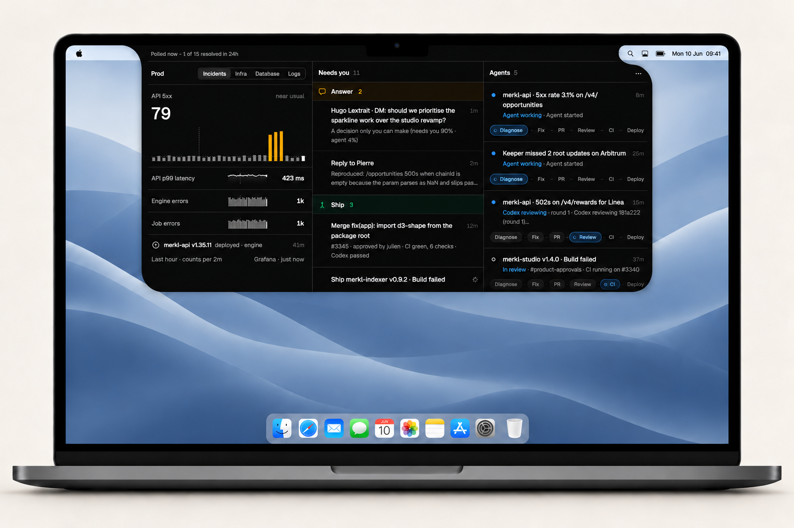
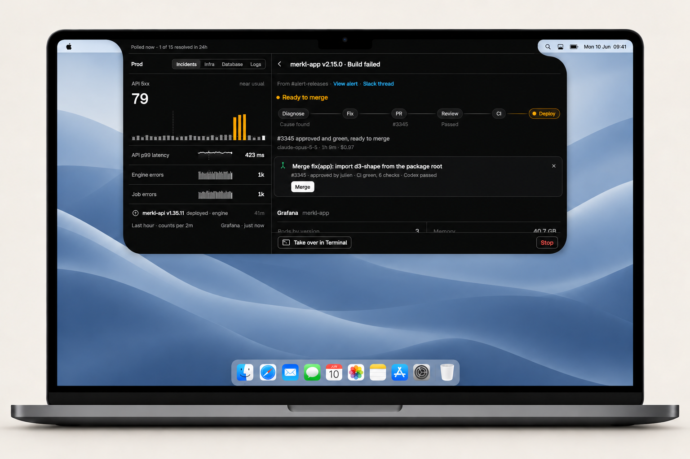

<div align="center">

# Bridgetown

**From Slack alert to reviewed fix. Right in your Mac’s notch.**

Choose your investigator and reviewer. You make the call.

[Try the demo](#try-it-locally) · [Set it up](#connect-your-workspace) · [How it works](docs/WORKFLOW.md)

</div>



Bridgetown is a macOS notch app. It watches Slack alerts, mentions, and DMs, gives the work an agent can handle to Codex or Claude Code, and brings the decisions that need you to the surface. Agents investigate in separate worktrees, prepare fixes, and follow them through review, CI, and deployment. You approve merges, releases, and replies.

Built for macOS with SwiftUI and a local Bun + Effect daemon. Currently tailored to Merkl’s Slack, GitHub Enterprise, and Grafana workflows.

## One glance. One decision.

- **Prod:** API errors, latency, infrastructure, database health, and log patterns in one view. Investigations can start from Grafana findings as well as Slack.
- **Needs you:** answer an agent, investigate an alert, merge a reviewed fix, cut a release, or send a prepared reply.
- **Agents:** see the current step, latest activity, and outcome of each session. Open one to inspect its work or take over in Terminal.

There is no menu bar item or Dock icon: the island in the notch is the app. At rest it shows running agents on its left and decisions waiting on you on its right, and a new decision drops a banner for a few seconds. Click it to expand Bridgetown from the notch itself, leaving your desktop visible around it; Esc or a click outside folds it back. On a screen without a notch it rests as a small black notch at the top centre, and opening Bridgetown again (Finder, Spotlight, `open -a Bridgetown`) always unfolds it. Blue marks live work, amber marks a decision, and green marks a verified outcome.

Open, its top line says how Bridgetown is doing, and its **…** menu holds Settings, Pause auto-start, Open logs, and Quit. ⌘, and ⌘Q work while it's open.

## From alert to deployment

Jev triages each item after deterministic rules filter routine notices and duplicates. Work goes to an agent, becomes a suggestion, or waits for you.

```text
Slack alerts + mentions + DMs     Grafana metrics + logs
              └──────────────────┬──────────────────┘
                           Rules + Jev
                                │
                      Agent in its own worktree
                                │
                      Draft PR → Model review → CI
                                │
                      You: merge → cut release
                                │
                      Track the production deploy
```

The selected reviewer checks the fix before the PR leaves draft. Blocking findings return to the same agent session for a fix or an evidence-backed rebuttal; red CI, requested changes, and a failed deploy go back to it too, up to three rounds, before they come to you. A decision is withdrawn as soon as its session moves past it ([how long each lasts](docs/API.md#cards)). The app keeps resolved, closed without a fix (a PR closed on GitHub included), failed, and stopped sessions distinct.



<sub>Screenshots from the running SwiftUI app with local demo data.</sub>

## Install

[Download the latest release](https://github.com/alexandre-schaffner/Bridgetown/releases/latest/download/Bridgetown.dmg) (Apple silicon, macOS 14 or later), open it, and drag Bridgetown to Applications. Releases aren't notarized yet: on first launch, open **System Settings → Privacy & Security** and click **Open Anyway**. Every release is signed and immutable; see [Releasing](#releasing) to verify one.

### Updates

Bridgetown checks GitHub for a newer release at launch and every 6 hours. A new version sends one notification and appears at the top of the prod column. Click **Install**, or use **Install Bridgetown x.y.z** in the **…** menu, to update. Bridgetown downloads the DMG and checks its SHA-256 against the digest GitHub recorded when the release was published. It then checks the DMG's Ed25519 signature against a public key built into the app you have. Only the release workflow holds the private key, so a DMG published any other way is refused before it is opened. Last, it checks that the app inside has Bridgetown's bundle identifier and the release's version, and that its code signature is intact, before swapping it in and relaunching. If any check fails, the app you have stays in place. If the new version doesn't open within a minute, the previous one goes back and opens instead. **Check for updates** in the same menu checks right away. To update in place, Bridgetown must run from a folder you can write to, such as Applications. If it runs from somewhere else, you get a download link instead.

## Try it locally

You need **macOS 14 or later**, **Swift 6 / Xcode Command Line Tools**, **Bun**, and **Git**. The demo needs no Slack token or AI account: Slack, Jev, agents, GitHub, and Grafana use local fixtures.

```sh
git clone https://github.com/alexandre-schaffner/Bridgetown.git
cd Bridgetown
bun install --cwd daemon
make mock
```

Leave the mock daemon running. In a second terminal, from the repository root:

```sh
make dev-app
```

Click the notch to open the app. The demo includes running investigations, questions, review and CI states, merge and release gates, and completed sessions. Actions run against the local mock services.

To watch the island's motion at the notch on its own (hover, banner, open, close):

```sh
make dev-app ARGS=--island-demo
```

## Connect your workspace

The current integration targets `Merkl/monorepo` on `nocturlab.ghe.com`. Repository paths and watched channels are configurable in Settings; GitHub targets, alert parsers, and production queries still contain Merkl-specific defaults. See [daemon/src/config.ts](daemon/src/config.ts) before adapting it to another team.

1. **Slack:** create a personal Slack app from [slack-app-manifest.yml](slack-app-manifest.yml), install it, and copy the `xoxp-…` user token.
2. **Jev:** get a TypeSafe API key for triage.
3. **Agent tools:** install and sign in to `claude`, `codex`, and `gh`. Verify GitHub Enterprise access with `gh auth status --hostname nocturlab.ghe.com`. Set `BRIDGETOWN_CODEX_PATH` if Codex isn’t on the app’s PATH.
4. **Observability:** run `bun grafana:mcp` in the Merkl monorepo. Investigators use Bridgetown’s fixed, read-only Grafana broker; repository MCP configurations are ignored.
5. **Build:** stop the demo daemon, then assemble and open the app:

   ```sh
   make all
   open build/Bridgetown.app
   ```

Open **Settings** from the app’s **…** menu. Save the Slack and TypeSafe tokens under **Accounts** (saving restarts the daemon with them), set the checkout paths under **Repos**, and choose channels and triage thresholds. Under **Models**, configure monitoring (investigation), reviewing and memory independently: Codex or Claude Code, a detected or custom model ID, and effort. **Automatic** keeps the existing depth-based profiles for monitoring and reviewing, and Claude Sonnet with medium effort for memory. Monitoring changes apply to new sessions; review and memory changes apply to the next job. Jev continues triage and finding judgment. Tokens are stored in macOS Keychain; if it refuses a read, Settings says so and saves only the fields you change.

**Dry run is on by default.** It suppresses Slack posts; agents can still run and prepare PRs. Turn off **Start agents automatically** under **Triage** to keep candidates waiting for your decision.

## Memory across messages and sessions

Bridgetown keeps a local [Agent Memory Repo](https://cognition.com/agent-memory-repo): linked Markdown notes in a
separate Git repository under `BRIDGETOWN_HOME/memory`. It learns from newly watched Slack messages, your answers
and actions, and agent findings and outcomes. Jev and investigation agents retrieve relevant context on later messages and sessions.
Existing history is not backfilled.

Open **Settings → Memory** to disable memory, see pending evidence and the last successful jobs, run learning and
consolidation now, or open the files. Learning runs about once a minute when evidence is pending;
consolidation runs every six hours when there is new evidence. Choose the provider, model and effort under
**Settings → Models → Memory**. Jobs use the selected provider's existing authentication and time out after two
minutes for learning or five minutes for consolidation. Claude jobs also cap spending at $0.50 and $1 respectively;
Codex does not report spending. No remote is configured.

You can edit the Markdown notes directly. Automatic writes pause while the memory repo has uncommitted edits;
commit your corrections to resume them. Notes retain their sources and distinguish statements and agent claims
from observed workflow outcomes. See [memory storage and corrections](docs/WORKFLOW.md#persistent-memory).

## You keep the controls

Each agent gets its own Git worktree and scoped broker tools. Generated commands and file operations run in a macOS OS sandbox with no network, no credentials, and restricted filesystem access. GitHub and Grafana reads go through fixed broker capabilities. Publishing scans an immutable snapshot, pushes only the session’s own branch to the configured repository, and creates or updates a draft PR.

Merging, cutting releases, and sending prepared replies require your click. Production environment approval remains with the reviewer team. External content is labelled as untrusted evidence; known credential patterns are redacted or rejected.

The inference client remains a trusted host process with its own login. This is a native process sandbox, with documented lifecycle and detection limits. See the [safety model](docs/WORKFLOW.md#safety-model) and [local storage policy](docs/WORKFLOW.md#storage-and-retention).

## Develop

Run these from the repository root:

| Command | Purpose |
| --- | --- |
| `make mock` | Start the daemon with local demo services |
| `make dev-app` | Attach the debug app to the running mock |
| `make dev` | Run the debug app with the daemon from source, your Keychain tokens on its stdin. Quit the installed app first, or set `BRIDGETOWN_PORT`: both use 47621 |
| `make all` | Compile the daemon and assemble `build/Bridgetown.app` |
| `make dmg` | Package the built app as `build/Bridgetown.dmg` |
| `make test-app` | Run Swift tests |
| `make check` | Run CI's checks: the daemon's types and tests, the Swift tests, and the landing page's build and tests (CI also builds the DMG) |
| `make e2e` | Draw and lint every screen off screen against a static mock, into `.context/e2e/` |
| `bun test --cwd daemon` | Run daemon tests |
| `bun run --cwd daemon check` | Type-check the daemon |
| `bun install --cwd site` | Install landing-page dependencies |
| `bun run --cwd site dev` | Start the Astro landing page |
| `bun run --cwd site test` | Run the landing page's tests |
| `make e2e-site` | Build the landing page if stale, then screenshot, lint and check it at six screen sizes, into `.context/e2e/`. Needs Chromium once: `bunx playwright-core install chromium` in `site/` |

Daemon tests mirror `src/` as `daemon/test/<folder>/<module>.test.ts`; the shared fakes, records, and test world live in `daemon/test/support/`, which the mock is built on too. What the daemon sends the app is declared once, in `daemon/src/api/wire.ts`, and pinned to the app's test fixtures ([the contract](docs/API.md#the-contract)). `bun scripts/session-smoke.ts` in `daemon/` runs one real agent session against a throwaway repo (it costs money) and exits 1 unless it reaches a result.

<details>
<summary><b>The mock daemon</b></summary>

`make mock` runs the real daemon (store, sessions, ship flow, gates, HTTP, and its own scheduler, with sessions, CI, and reviews sped up) on a throwaway store, with Slack, Jev, the agent, GitHub, and Grafana faked. Nothing leaves the machine. Started by hand it listens on `127.0.0.1:47621` and answers the token `dev` (or `BRIDGETOWN_API_TOKEN`), which `make dev-app` sends. It never reads the terminal, so `make mock &` works.

| Variable | Effect |
| --- | --- |
| `BRIDGETOWN_PORT=47650` | Another port |
| `MOCK_EXTRA=1` | The running agent also asks a question |
| `MOCK_GITHUB=blocked` | GitHub Enterprise refuses this network from the start; `kill -USR1 <pid>` toggles it |
| `MOCK_GRAFANA=live` | Real prod charts through the local Grafana MCP (read-only) |
| `MOCK_RELEASE_HOLD_SECONDS=600` | How long the release in flight at startup takes |
| `MOCK_STATIC=1` | Nothing moves: no scheduler, no agents, the release held in flight (what `make e2e` runs) |
| `MOCK_WORLD=empty` | A fresh install that has received nothing yet |
| `MOCK_NOW=2026-10-04T12:00:00Z` | The wall clock stopped there |
| `MOCK_ROOT=/tmp/bt-mock` | The throwaway root at a fixed path, not a temp dir |
| `MOCK_API_TOKEN=other` | Answers only this token, so the app that launched it is turned away |

Launched like the daemon (`BRIDGETOWN_DAEMON_CMD="bun /abs/path/daemon/scripts/mock/main.ts"`), it takes its token on stdin, exits when stdin closes, and reads control lines after it: `{"mock":"status","patch":{"github":"blocked"}}` patches the status (an `error` in it is reported as a problem), and `{"mock":"crash","code":98}` exits at once with that code.

</details>

<details>
<summary><b>The app's e2e</b></summary>

`make e2e` builds the debug app and runs every step of `app/E2E/suite.json` against the static mock, on a port of its own (never 47621). The app sets the mock's world, clock and store itself, whatever your shell exports. Each shot is drawn off screen and linted for layout. The run doesn't touch your world: the Keychain is in memory, the clock stops at the suite's instant, links and notifications are recorded rather than opened, and no prompt or window reaches the screen.

It writes `.context/e2e/<UTC time>/` (`latest` points at it; the newest five stay): `index.md` first, `report.json`, `shots/`, `issues/` (a crop per issue), `diff/`, and the app's and daemon's logs. It exits 0 when clean, 1 on lint errors, and 2 when the harness failed.

- `ONLY='overview*'` takes only the shots whose names match; every step still runs.
- `SUITE=<file>` runs another suite, and `SUITE=none` none (with `SERVE=1`, straight to serving).
- `BASELINE=<run dir>` diffs against that run instead of the previous `latest`, and `BASELINE=` against none. A partial run becomes `latest` too, so pass a full run's directory while you iterate with `ONLY`.
- `{"hover": "needsYou.row.<id>"}` drives row hover from its accessibility frame; `{"hover": false}` leaves it. Hover buttons can then be clicked by their label inside the pane (for example, `{"click": "Merge", "in": "pane.needsYou"}`). SwiftUI exposes controls inside a row's label as named accessibility actions, so use `{"action": {"on": "<row identifier>", "name": "Select"}}` or a quick reply's label rather than a pixel offset.
- `{"see": "<label>"}` asserts that an accessibility element is present; the suite uses it to check problem banners before photographing them. `{"restart": {"exitsAtStart": true}}` exercises the daemon that keeps stopping diagnostic.
- `{"update": "available"}` shows the update notice in a state (`none`, `checking`, `upToDate`, `available`, `downloading`, `installing`, `installed`, `failed`, `checkFailed`) for a made-up 1.2.0, over an installed 1.1.0; **Install** and **Quit** are recorded as side effects, and **Check for updates** finds that 1.2.0.
- `{"each": "actions", "title": "<exact title>", "do": [...]}` selects stable titles and fills `$id` in each step; a missing title fails the run. The optional title filter also works for sessions and alerts.
- `SERVE=1` keeps the app up afterwards for an agent to drive. `.context/e2e/latest/control.json` holds a loopback `url` and a `token`; send the token as `X-E2E-Token`, then `POST /step` with one suite step as JSON (it answers `{ok, shots, error}`, each shot with its PNG and issues), `GET /tree` for the screen's accessibility tree and its lint, `GET /state`, and `POST /quit`. A run that hears nothing for 10 minutes ends.

</details>

<details>
<summary><b>The landing page</b></summary>

`site/` is an Astro page with three.js. `src/scripts/main.ts` holds what moves across chapters (the hero's dawn and board, the camera, the light); a widget that keeps to its own chapter runs from its component, and the facts the page shares with the launch film live in `src/lib/story.ts`.

- `bun run build` writes `worker/media.json` (the films' sizes, for the Worker that answers Safari's byte-range requests; generated, not committed), checks the types, builds, and fails if the built pages inline a script or style the Content-Security-Policy doesn't allow.
- `bun run test` writes `media.json` first, so use it rather than a bare `bun test`.
- `bun run deploy` (`wrangler deploy`, which builds first) runs only in GitHub Actions: see [Releasing](#releasing).
- Every response carries the headers in `public/_headers`: `nosniff`, `X-Frame-Options: DENY`, a referrer policy, HSTS, a Permissions-Policy, and a Content-Security-Policy that allows the site's own scripts, styles, fonts, images, and films and nothing else, plus the one inline theme script (by its hash) and style attributes.
- The films in `public/media/` are recorded from rigs that exist only under `astro dev` (`/film` and `/launch`; nothing of them ships). `bun run record film/keynote`, `film/launch`, or `film/island` draws a cut frame by frame on the rig's own clock into `public/media/` (it needs ffmpeg; `--poster <s>` also writes its poster). `bun run record launch` writes the full launch film to `.context/films/launch.mp4`, with `launch.cues.json`, the cues its score is built from.

`make e2e-site` builds the page if `dist/` is stale, serves it with those headers on a free port, and walks `/` and the 404 in separate browser contexts, four walks at a time, at 375×812, 812×375, 768×1024, 1280×800, 1512×982, and 1920×1080, with and without Reduce Motion, linting every scroll stop. Then it runs 16 checks of what the page has to do (one on a 320×568 phone). It writes `.context/e2e/<run>/site/` (`latest-site` points at it; the newest five stay) and exits 0, 1, or 2 like `make e2e`. `ARGS=--quick` takes one stop per section, `--jobs 1` walks serially for comparisons (1–4 are accepted), `--only <part of a shot name>` one walk (`375x812`, `checks`), `--no-build` skips the build, and `--dist <dir>` walks another one. An allowlist entry in `site/scripts/e2e/lint.ts` says why the issue is the design, and may name a `media` query, so the same issue on other screens is still reported.

</details>

<details>
<summary><b>Environment</b></summary>

| Variable | Read by | Effect |
| --- | --- | --- |
| `BRIDGETOWN_DAEMON_CMD` | app | Run this as the daemon, through `/bin/sh -c "exec <cmd>"`: one command (`bun /abs/path/daemon/src/main.ts`), not a list. `make dev` sets it |
| `BRIDGETOWN_ATTACH=1` | app | Start no daemon; attach to a running one with `BRIDGETOWN_API_TOKEN`. `make dev-app` sets both |
| `BRIDGETOWN_LOG_DIR` | app | Where `daemon.log` goes (`~/Library/Logs/Bridgetown`) |
| `BRIDGETOWN_PORT` | app, daemon | The daemon's loopback port (47621) |
| `BRIDGETOWN_HOME` | daemon | The store, isolated provider configuration, and the worktrees of a repo without `.shared/` (`~/Library/Application Support/Bridgetown`) |
| `BRIDGETOWN_CLAUDE_PATH`, `BRIDGETOWN_CODEX_PATH` | daemon | The `claude` and `codex` to run, instead of the ones on the PATH (from source, the SDK's own `claude`) |
| `CLAUDE_CONFIG_DIR` | daemon | Where the Claude CLI keeps conversations (`~/.claude`), for housekeeping |
| `BRIDGETOWN_DRY_RUN=1`, `--dry-run` | daemon | Never post to Slack, whatever Settings say |
| `--paused` | daemon | Start paused |
| `JEV_MODEL` | daemon | The Jev model (`jev-1.13.0`) |

The app runs the first of `BRIDGETOWN_DAEMON_CMD`, `BRIDGETOWN_ATTACH=1`, and its bundled daemon. The daemon reads its variables once at launch, so a change needs a restart. The app hands its own environment on to the daemon it starts, secrets aside; daemon flags go in `BRIDGETOWN_DAEMON_CMD`. Opened from Finder, the app has launchd's environment: set a variable there with `launchctl setenv`, then quit and reopen Bridgetown.

</details>

To update the README visuals, see the [screenshot capture guide](docs/images/README.md).

## Inside the repository

| Path | What lives here |
| --- | --- |
| [app/](app/) | SwiftUI app, notch interface, Keychain storage, daemon lifecycle |
| [daemon/](daemon/) | Slack ingestion, triage, agent sessions, model review, shipping, Grafana monitoring |
| [site/](site/) | Astro landing page, three.js visuals, and product recordings |
| [docs/API.md](docs/API.md) | Local HTTP/SSE contract between the app and daemon |
| [docs/WORKFLOW.md](docs/WORKFLOW.md) | Decision policy, safety boundaries, storage and retention, and Slack posting behavior |
| [docs/FEATURE-MAP.md](docs/FEATURE-MAP.md) | Current capabilities, workflow connections, human decisions, and control boundaries |
| [PRODUCT.md](PRODUCT.md) | Product purpose and design principles |
| [.github/workflows/](.github/workflows/) | CI, releases, and the landing-page deploy |

## Releasing

Every PR runs [CI](.github/workflows/ci.yml): daemon types and tests, Swift tests and a full DMG build, the landing-page build, and actionlint and zizmor on the workflows. `ci-ok` is the one check to require. PRs are squash-merged with a [conventional](https://www.conventionalcommits.org/) title, which sets the next version: `feat` is a minor release before 1.0; `fix`, `perf`, and `deps` are patches; everything else releases nothing.

[Dependency patch batches](.github/workflows/dependency-release.yml) run daily at 06:17 UTC. The [policy](scripts/dependency_release.py) merges green Dependabot PRs containing only allowlisted stable patches in manifests and lockfiles. The daemon allows `zod`, `@types/bun`, and `typescript`; the site also allows fonts, animation, icons, Three.js, types, and Playwright. Claude/Anthropic, Effect, MCP, agent SDKs, frameworks, deployment tools, and non-patch updates require review, including transitive changes.

Each batch checks the combined `main` commit. Runtime patches then refresh and test the next patch release PR before merging, publishing, and deploying. Site/tooling patches only deploy the site. Source or manual dependency changes hold app releases; active or failed pipelines and draft releases hold the batch. Bot merges explicitly dispatch workflows because `GITHUB_TOKEN` merges do not trigger push workflows. Manual dispatch defaults to read-only; select `apply` to process a batch. Locally, using your `gh` login: `GH_REPO=alexandre-schaffner/Bridgetown python3 scripts/dependency_release.py`.

On `main`, [release-please](https://github.com/googleapis/release-please) keeps a release PR open with the changelog and the version bumps in `app/Info.plist`, `daemon/package.json`, and `daemon/src/config.ts`. Merging it runs [release.yml](.github/workflows/release.yml):

1. release-please tags the version and opens a draft release.
2. A read-only macOS job builds the DMG and checks it with `scripts/verify-bundle.sh`.
3. A separate job, in the `release` environment, signs the DMG for in-app updates (`Bridgetown.dmg.sig`) and checks that signature against the public keys in the tagged `app/Info.plist`. It then signs `SHA256SUMS` with cosign (keyless), attests the DMG's build provenance, uploads everything to the draft, and publishes it. From then on the release and its tag are immutable.
4. The landing page redeploys so its download button names the new version.

Verify a download:

```sh
shasum -a 256 -c SHA256SUMS
cosign verify-blob SHA256SUMS --bundle SHA256SUMS.sigstore.json \
  --certificate-identity https://github.com/alexandre-schaffner/Bridgetown/.github/workflows/release.yml@refs/heads/main \
  --certificate-oidc-issuer https://token.actions.githubusercontent.com
gh attestation verify Bridgetown.dmg -R alexandre-schaffner/Bridgetown
```

In-app updates trust the Ed25519 keys listed in `BridgetownUpdatePublicKeys` in `app/Info.plist`, normally one. The private half is the `UPDATE_SIGNING_KEY` secret (PEM) in the `release` environment, which only deploys from `main`. GitHub can't give a secret back, so keep a backup elsewhere. To rotate the key, for example after it leaks or is lost, generate a new one (`openssl genpkey -algorithm ed25519`) and add its public half to the list. Once a release with both keys is out, replace the secret, and drop the old key in a later release. An app that can't check a signature (no key, or a broken one) offers the download instead of installing.

If a build or publish fails, the draft and tag stay put: re-run the failed jobs, or run `release.yml` by hand with the draft's tag. The landing page also deploys on its own when `site/` changes on `main`, using Cloudflare repository secrets passed explicitly by the release workflow and the `production` environment to restrict deployment to `main`. That is the only way it ships: `bun run deploy` refuses to run outside GitHub Actions, so a working tree that was never committed can't go live and then vanish at the next deploy. To redeploy without a change, run `gh workflow run deploy-site.yml`.
