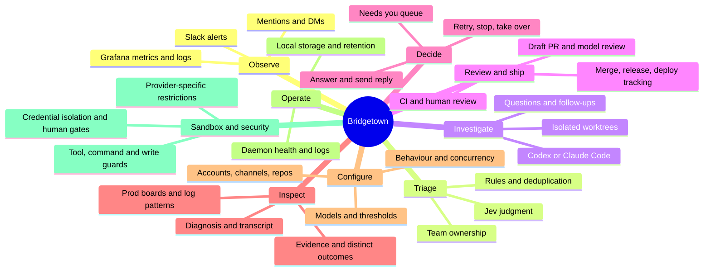
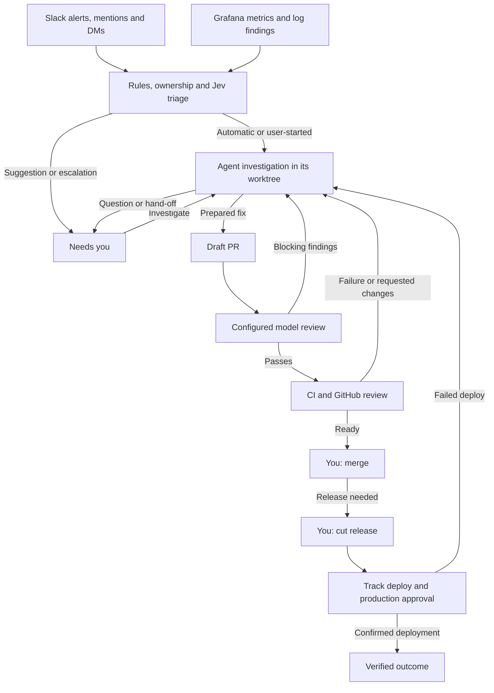

# Bridgetown feature map

[← Back to the README](../README.md)

Bridgetown turns production signals and Slack requests into agent investigations, reviewed fixes, and decisions for the engineer. Its primary surfaces are **Prod**, **Needs you**, and **Agents**, inside a macOS notch island.

This maps the current repository as of 7 October 2026. Features are grounded in documentation and implementation; this is an inventory, not a roadmap or a claim that every integration has been exercised live.

## Capability map

## Features by area

| Area | Current capabilities | User surface / evidence |
| --- | --- | --- |
| **Slack intake** | Poll watched channels for bot alerts; watch personal/group mentions and DMs; route follow-ups to an existing agent; recover missed reads within a bounded window. | Alert and session origins. [Intake](../daemon/src/intake/), [Slack thread handling](../daemon/src/slack/thread.ts). |
| **Production monitoring** | Incidents, infrastructure and database boards with deploy markers; detect metric rises/spikes; group error and risky-warning logs; use Jev to judge candidates; turn findings into investigations or suggestions. | Prod → Incidents / Infra / Database / Logs; Grafana dashboard and Explore links. [Prod UI](../app/Sources/Bridgetown/Views/Telemetry/TelemetryPanel.swift), [watchers](../daemon/src/watch/). |
| **Triage and ownership** | Filter routine notices before model calls; attach duplicate alerts to their session; judge actionability, delegability, human involvement, depth and urgency; auto-start, suggest, escalate, ignore or filter; use Slack claims and teammate reactions to avoid duplicate ownership. | Alert verdicts and scores; teammate ownership; Investigate anyway. [Triage](../daemon/src/triage/), [claims](../daemon/src/slack/claims.ts), [policy reference](WORKFLOW.md). |
| **Agent investigation** | Queue sessions with bounded concurrency; run Codex or Claude Code in separate Git worktrees; diagnose, fix, prepare a PR, recommend action or request human help; ask questions and accept follow-ups in the same conversation. | Agents list and session detail. [Session lifecycle](../daemon/src/sessions/), [agent tools](../daemon/src/agent/tools.ts). |
| **Persistent memory** | Learn attributed facts from newly watched messages, user actions and agent claims; recall bounded context across sessions; consolidate a local Markdown repository; pause automatic writes during manual edits. | Settings → Memory; scoped memory tools for investigators. [Memory service](../daemon/src/memory/), [storage and corrections](WORKFLOW.md#persistent-memory). |
| **Model review** | Keep fixes in draft while a configured reviewer examines the diff read-only; have Jev judge findings; return blocking findings to the investigator for fixes or evidence-backed rebuttals; hand off after the retry budget. | Session review findings and progress; review toggle and model settings. [Review implementation](../daemon/src/critique/), [round limits](../daemon/src/critique/transitions.ts). |
| **Shipping** | Track CI and GitHub reviews; request team review; send failed CI, requested changes and failed deploys back to the agent; offer merge and release gates; follow the release tracker and production approval; recognize a PR closed without merging. | Merge / Release / Re-run decisions, PR links and deploy progress. [Shipping](../daemon/src/ship/), [transitions](../daemon/src/ship/transitions.ts). |
| **Human decisions** | Investigate a suggestion; open an escalation; answer an agent; inspect a hand-off or retry a failure; merge; cut a release; approve a pipeline re-run; edit and send a prepared reply. Withdraw stale session decisions when the session moves on. | Needs you queue; decisions also appear in session detail. [Action types and validity](../daemon/src/domain/action.ts), [handlers](../daemon/src/actions/handlers.ts). |
| **Session inspection and control** | See current activity, diagnosis, PR, branch, CI, model, available cost and transcript; message the session; stop or retry; take over the saved provider conversation in Terminal and lock its worktree against cleanup. | Session detail, context menus and external links. [Session UI](../app/Sources/Bridgetown/Views/Detail/SessionDetailView.swift), [system actions](../app/Sources/Bridgetown/SystemActions.swift), [retention](WORKFLOW.md#storage-and-retention). |
| **Notch experience** | Collapsed live-work and decision indicators; temporary decision banner; expandable overview and detail; keyboard shortcuts, selection and bulk actions (one list at a time); clearing Recent, with undo; swipes, haptics, accessible labels and Reduce Motion support; top-centre fallback without a hardware notch. | Notch island; Prod / Needs you / Agents / Recent; app menu. [Overview](../app/Sources/Bridgetown/Views/Overview/OverviewSections.swift), [presentation](../app/Sources/Bridgetown/Presentation.swift), [product principles](../PRODUCT.md). |
| **Configuration** | Keychain accounts and launch at login; channel and inbox selection; auto-start, concurrency and polling; triage/review thresholds; independent investigation/review provider, model and effort; repository paths; dry run, review and monitoring toggles; quiet hours. | Settings → Accounts / Channels / Triage / Models / Repos / Behaviour; Pause auto-start in the app menu. [Settings UI](../app/Sources/Bridgetown/Views/SettingsView.swift), [models UI](../app/Sources/Bridgetown/Views/ModelsTab.swift), [defaults](../daemon/src/domain/settings.ts). |
| **Local operations and safeguards** | Local SQLite history and transcripts; authenticated loopback HTTP/SSE; daemon lifecycle and health reporting; rotating logs; retention and worktree cleanup; stripped agent credentials, command checks and tool-write boundaries. | Health/problem messages and Open logs. [API](API.md), [daemon lifecycle](../app/Sources/Bridgetown/DaemonProcess.swift), [housekeeping](../daemon/src/housekeeping/), [guard boundaries](WORKFLOW.md#safety-model). |
| **Sandboxing and security** | macOS OS sandbox for generated commands and file operations; broker-only provider tools; fixed GitHub/Grafana capabilities; credential separation; immutable scanned draft publication; read-only review and human gates. | Enforcement mostly runs beneath the UI; refusals are recorded in investigation activity. [Security map below](#sandboxing-and-security), [guard implementation](../daemon/src/guard/). |
| **Demo and development** | Local fixture-backed demo; real daemon orchestration with fake external services; Swift/daemon tests; off-screen app screenshots and layout lint; landing page and product recordings. | Developer commands and repository tooling. [Development guide](../README.md#develop), [app E2E suite](../app/E2E/suite.json), [site](../site/). |

## How the features connect

The fix path below is one possible outcome. An investigation can also end with no action, a recommendation, a drafted reply, or a hand-off to the engineer.

Model review can be disabled in Settings. Retry loops are bounded: model review can send a PR back up to **four times**; CI failures, requested changes and failed deploys share **three** repair rounds before hand-off. Production environment approval remains with the reviewer team. See [review limits](../daemon/src/critique/transitions.ts) and [shipping limits](../daemon/src/ship/transitions.ts).

## The human decision map

These are the eight underlying action kinds; their visible button labels depend on context.

| Decision | What the engineer does |
| --- | --- |
| Investigate | Start an agent on a suggested alert or finding. |
| Answer | Supply an answer or choose an option for an agent's question. |
| Review / retry | Inspect a hand-off and close it, or retry a failed session. |
| Merge | Authorize merging a PR that is ready. |
| Release | Authorize cutting the release after merge. |
| Re-run | Authorize re-running failed jobs in the shipping workflow. |
| Reply | Review or edit the draft, then send it to the Slack thread or DM. |
| Escalate | Open the item in Slack or Revv for human handling. |

See the [action contract](../daemon/src/domain/action.ts) and [action handlers](../daemon/src/actions/handlers.ts). Dismissing some waiting decisions closes the session without a fix; it does not mark it resolved.

## Sandboxing and security

A worktree separates changes between sessions; the OS sandbox and broker enforce access. Claude and Codex use the same capability boundary while their inference clients remain trusted host processes.

| Capability | Enforcement | Limit / source |
| --- | --- | --- |
| **Generated commands and files** | Per-operation macOS Seatbelt sandbox; no network, credentials, Keychain IPC or arbitrary host files; protected configuration writes denied. | macOS only, with runtime/system read allowances. Launch failure refuses access. [Sandbox](../daemon/src/security/sandbox.ts), [file broker](../daemon/src/security/files.ts). |
| **Provider tool authority** | Built-in tools, user/repository settings and arbitrary MCP servers excluded; unknown tool calls denied. Codex checks that the required synchronous guard loaded. | Inference clients and their authentication remain trusted host software. [Claude](../daemon/src/agent/options.ts), [Codex](../daemon/src/agent/codex.ts), [capabilities](../daemon/src/security/capabilities.ts). |
| **Network reads** | Typed GitHub reads pinned to Merkl’s repository; fixed Grafana metrics/log operations, incident windows and response limits. | Direct Merkl MCP, arbitrary API calls and public endpoint probes require a human. [Broker](../daemon/src/security/broker.ts), [observability](../daemon/src/security/observability.ts). |
| **Fix publication** | Scan an immutable snapshot, stage exact bytes without filters, compare the parent ref, push the exact commit to the session branch and restore draft before updating a PR. | Bounded UTF-8 regular files only; credentials and authority-changing files refused. [Publication](../daemon/src/security/broker.ts), [snapshot](../daemon/src/security/files.ts). |
| **Prompt injection and secret handling** | External content is labelled/fenced as untrusted; known credential patterns redacted or rejected; generated subprocess environment has no authentication. | Heuristics do not detect all secrets or prevent all malicious reasoning. Evidence still reaches the chosen inference provider. [Policy](../daemon/src/security/policy.ts), [prompts](../daemon/src/sessions/prompts.ts), [environments](../daemon/src/secrets.ts). |
| **Independent review** | Same pinned-head diff for both providers; only scoped source reads afterward. | No shell, network, writes or Slack. [Reviewer](../daemon/src/critique/reviewer.ts). |
| **Human gates** | Engineer authorizes merges, releases, approved re-runs and teammate replies. | Branch protections and production approvals remain external controls. [Handlers](../daemon/src/actions/handlers.ts), [shipping gates](../daemon/src/ship/gates.ts). |

Commands have time/output budgets and ordinary process-group cleanup. Deliberately detached processes can survive while retaining the sandbox’s restrictions; publication uses a scanned snapshot so their later changes cannot race into a pushed fix. This is native sandboxing, not VM isolation. [Full safety model and operational limits](WORKFLOW.md#safety-model).

## Outcome and control boundaries

- **Resolved, closed, failed and stopped are distinct outcomes.** Milestones record evidence for diagnosis, fix, PR, model review, CI, merge, release and deployment. A finished session does not imply a fix deployed. [Session model](../daemon/src/domain/session.ts).
- **Dry run suppresses Slack posts.** Agents can still investigate and prepare PRs. It is enabled by default. [Default settings](../daemon/src/domain/settings.ts), [behaviour UI](../app/Sources/Bridgetown/Views/SettingsView.swift).
- **Quiet hours suppress notifications.** Auto-start continues running; disabling or pausing auto-start is a separate control. [Behaviour UI](../app/Sources/Bridgetown/Views/SettingsView.swift).
- **Model choices are independent by role.** Investigation settings are captured by new sessions; the next model review reads the current reviewing choice. Jev remains responsible for triage and finding judgment. [Workflow policy](WORKFLOW.md#how-decisions-are-made).
- **The current integration is tailored to Merkl.** GitHub Enterprise targets, alert parsing and production queries have team-specific defaults. This inventory does not imply general-purpose support for arbitrary workspaces. [Setup scope](../README.md#connect-your-workspace).
- **Storage is local; integrations make external calls.** SQLite and logs stay on the Mac, while Slack, GitHub, Grafana and model providers support the workflow. Tool guards have documented limits; human approvals and GitHub protections remain part of the boundary. [Storage](WORKFLOW.md#storage-and-retention), [safety model](WORKFLOW.md#safety-model).
